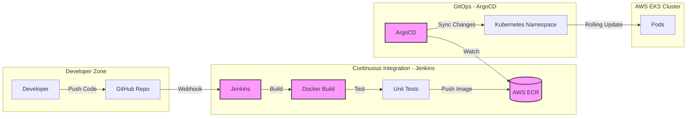
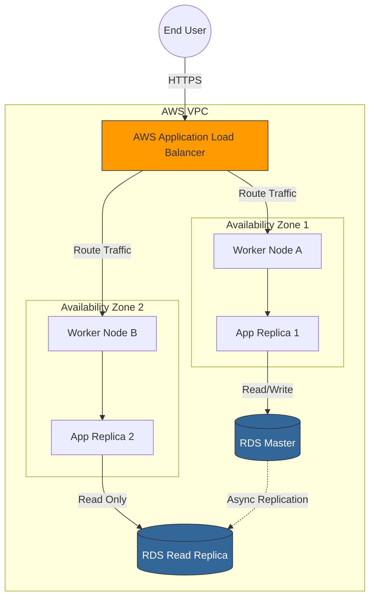
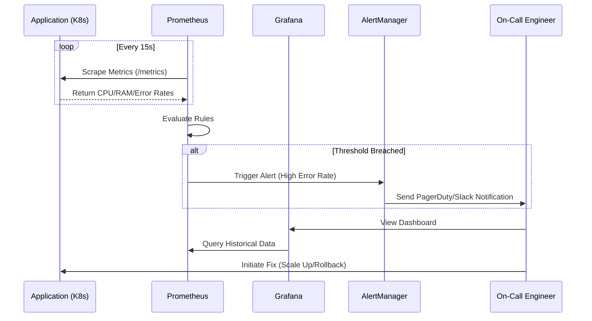

As a Senior DevOps Engineer, I design systems that prioritize **scalability**, **fault tolerance**, and **observability**. Below are the architectural patterns I implement to achieve these goals, visualized directly from code using Mermaid.js.

---

## 1. GitOps CI/CD Pipeline
This workflow demonstrates the automation strategy I implemented at Dell Technologies, achieving a **50% reduction in deployment time**. It ensures that the state of the cluster always matches the Git repository.

## 2. High-Availability Deployment Topology
This topology illustrates a multi-AZ Kubernetes deployment with load balancing and replicated data services for resilience.

## 3. Monitoring and Alerting Sequence
This sequence shows how telemetry is collected, evaluated, and routed to on-call responders for fast remediation.

